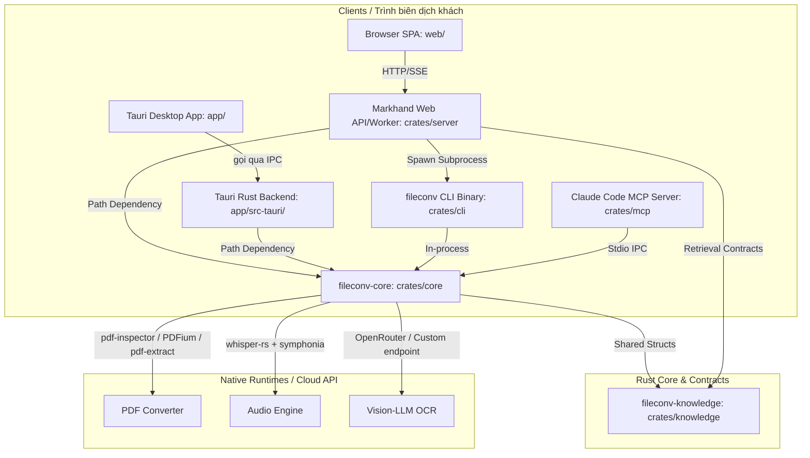

# fileconv — convert mọi file sang Markdown (Rust)

Backend Rust chuyển đổi tài liệu / ảnh / âm thanh sang **Markdown**, tối ưu **tiếng Việt**.
Code do dự án làm chủ hoàn toàn (gọi thẳng crate gốc). Mục tiêu: đóng gói thành
**desktop app (Tauri)** cho Win / Mac / Ubuntu.

> **Trạng thái: backend + kiểm thử hiệu năng/độ chính xác + Markhand desktop v0.1.0;
> auto-update via GitHub Releases; `.deb` Linux đã build, CI release matrix Win/Mac/Linux;
> Win/Mac cần artifact thật và signing/notarization.**

## Ưu tiên xuyên suộc

> **Độ chính xác nội dung tiếng Việt > giữ format 100%.**

## Tài liệu

| Muốn biết... | Xem |
|---|---|
| Mục đích, yêu cầu sản phẩm, vị thế thị trường | [`docs/project-overview-pdr.md`](docs/project-overview-pdr.md) |
| Bản đồ code — sửa thì đụng file nào | [`docs/codebase-summary.md`](docs/codebase-summary.md) |
| Quy ước, pin crate, cache pattern, cạm bẫy | [`docs/code-standards.md`](docs/code-standards.md) |
| Setup contributor và quality gates | [`CONTRIBUTING.md`](CONTRIBUTING.md) |
| Kiến trúc — định tuyến, IPC, MCP, sơ đồ | [`docs/system-architecture.md`](docs/system-architecture.md) |
| Lộ trình (đã xong / đang làm / backlog) | [`docs/project-roadmap.md`](docs/project-roadmap.md) |
| Số liệu đo thực | [`bench/REPORT.md`](bench/REPORT.md) |
| 90 file internet / 9 họ converter | [`bench/REPORT_CORPUS10.md`](bench/REPORT_CORPUS10.md) |

Hướng dẫn nhanh cho agent: [`CLAUDE.md`](CLAUDE.md).

## Cấu trúc

```
crates/core/    # fileconv-core: LÕI convert — dùng chung bởi CLI + app + MCP + server
crates/cli/     # fileconv: binary CLI + bench harness (đo tốc độ / CER/WER)
crates/mcp/     # fileconv-mcp: MCP server cho Claude Code
crates/knowledge/ # knowledge contracts dùng chung desktop/server
crates/server/  # Markhand Web API/worker boundary
app/            # Markhand: desktop app Tauri 2 + React 19
web/            # Markhand Web browser SPA (HTTP/SSE, không Tauri)
deploy/         # local Compose và deployment scripts
bench/          # script tải corpus + sinh dữ liệu VN + các REPORT*.md
vendor/         # markitdown-rs — CHỈ tham khảo (MIT, đã exclude khỏi workspace)
```

### Sơ đồ kiến trúc & Luồng dữ liệu (Mermaid)



## Định dạng hỗ trợ

pdf, docx, pptx, xlsx/xls/xlsb/ods, csv, html + **ảnh OCR tiếng Việt** (vision-LLM
qua OpenRouter mặc định — `FILECONV_OCR_*`; Tesseract/Paddle local đã loại bỏ, ADR 0016) +
**audio tiếng Việt** (whisper-rs + symphonia). PDF quét → render 300 DPI + OCR vision.

## Kết quả tóm tắt (Intel Xeon 2.8GHz, release)

- **Tốc độ** (60-file corpus): pptx/csv/xlsx/docx < 1ms/file; pdf **~5.7ms/trang**; html ~15ms/file. 100% convert.
- **Độ chính xác VN**: docx/csv 100%, html 99.2%, xlsx 98.5%, pptx 98.0%; ảnh in OCR ~99%
  (số liệu lịch sử đo trên stack Tesseract cũ — OCR hiện qua vision-LLM, ADR 0016).
- **Audio vi** (gTTS): tiny 86.8% / base 94.5% / small 97.0% (RTF 0.15 / 0.30 / 0.99).
- **PhoWhisper** (clip vi thật): **90.8%** vs whisper-small 77.3% (**+13.5 điểm**, cùng cỡ model).

Chi tiết: [`bench/REPORT.md`](bench/REPORT.md) + [`docs/system-architecture.md`](docs/system-architecture.md).

## Chạy thử

Yêu cầu: Rust, `poppler-utils`, `imagemagick` (bench), `python3`.
Build whisper-rs cần cmake + C/C++ + clang.
OCR ảnh/PDF scan cần key vision-LLM: `export FILECONV_OCR_API_KEY=...`
(mặc định OpenRouter; endpoint self-host vLLM/Ollama vision dùng
`FILECONV_OCR_BASE_URL` khi có GPU).

### Toàn bộ Subcommand hỗ trợ (CLI)

| Subcommand | Đối số & Cờ chính | Mục đích |
|---|---|---|
| `one` | `<file> [--ocr-images --lang vie+eng --pages 1,2,3 --sheet NAME --max-chars N]` | Convert 1 file → stdout (Markdown thuần) |
| `one-detailed` | giống `one` (+ `--no-pdf-ocr`) | Convert → JSON `{markdown,title,format,outcome,warnings}` hoặc lỗi `{message,kind}` |
| `speed` | `<dir> [report.md]` | Đo tốc độ (ms/file, ms/page, KB/s) |
| `accuracy` | `<manifest.tsv> [report.md]` | Đo độ chính xác CER/WER tiếng Việt vs Ground-truth |
| `audio` | `<models> <manifest.tsv> [report.md]` | Đo WER/RTF cho các model Whisper (phân tách bởi dấu phẩy) |
| `handoff` | `<product> <output.zip> <sources...>` | Đóng gói handoff pack (BRD/PRD) từ nhiều file nguồn |
| `pptx-preview` | `<file.pptx>` | Xuất JSON preview cho slide/shapes trong PPTX |
| `info` | (không) | Xem các định dạng được hỗ trợ và trạng thái PDFium/Whisper |

### Lệnh chạy mẫu

```bash
# 1) Build
cargo build --release

# 1b) PDFium (thiếu → tự fallback pdf-extract)
bash bench/download_pdfium.sh

# 2) Convert 1 file → stdout
./target/release/fileconv one duong-dan/file.docx

# 2b) Convert chi tiết xuất ra JSON
./target/release/fileconv one-detailed duong-dan/file.docx

# 3) Đo tốc độ
bash bench/download_corpus.sh
./target/release/fileconv speed bench/corpus bench/REPORT_SPEED.md

# 4) Đo độ chính xác tiếng Việt
python3 bench/make_vn_corpus.py && bash bench/make_vn_images.sh
./target/release/fileconv accuracy bench/vn_corpus/manifest.tsv bench/REPORT_ACCURACY.md

# 5) Audio (whisper)
bash bench/download_models.sh && python3 bench/make_vn_audio.py
./target/release/fileconv audio models/ggml-base.bin bench/vn_audio/manifest.tsv bench/REPORT_AUDIO.md
```

### Biến môi trường cấu hình (Environment Variables)

- **Cấu hình OCR (`fileconv-core`):**
  - `FILECONV_OCR_API_KEY`: API Key cho vision OCR (mặc định OpenRouter, fallback về `FILECONV_LLM_API_KEY`).
  - `FILECONV_OCR_BASE_URL`: Endpoint API cho OCR (mặc định `https://openrouter.ai/api`).
  - `FILECONV_OCR_MODEL`: Model vision sử dụng (mặc định `qwen/qwen3.7-flash`).
  - `FILECONV_OCR_SYSTEM_PROMPT`: Tùy chỉnh prompt hướng dẫn cho model OCR.
  - `FILECONV_OCR_TIMEOUT_SECS`: Thời gian timeout cho yêu cầu OCR (mặc định 180s).
- **Cấu hình LLM (`fileconv-mcp` & Server):**
  - `FILECONV_LLM_PROVIDER`: Nhà cung cấp LLM (`openai` \| `anthropic` \| `gemini` \| `openai-compatible`).
  - `FILECONV_LLM_API_KEY`: API Key cho các tác vụ LLM bổ sung.
  - `FILECONV_LLM_BASE_URL`: Base URL của provider LLM.
  - `FILECONV_LLM_MODEL`: Model LLM chỉ định.
- **Cấu hình Native Runtimes:**
  - `FILECONV_PDFIUM_LIB`: Đường dẫn ghi đè thư mục chứa thư viện PDFium.
  - `FILECONV_WHISPER_MODEL`: Đường dẫn trực tiếp đến file model whisper GGML `.bin`.
  - `FILECONV_WHISPER_CACHE_CAPACITY`: Kích thước cache model Whisper trong LRU (mặc định là 2).

### Desktop app "Markhand"

```bash
cd app
pnpm install
pnpm tauri dev      # bản dev (cần cùng phụ thuộc native phía trên)
```

### MCP server cho Claude Code

```bash
cargo build --release -p fileconv-mcp
claude mcp add fileconv -- ./target/release/fileconv-mcp
# tool LLM (summarize/translate/ocr_hard...) cần env FILECONV_LLM_*
```

## Đã sửa so với markitdown-rs (bản tham khảo)

Bản viết lại do mình làm chủ, khắc phục các lỗi phát hiện qua benchmark:
- `html2md` phình output → `htmd` (nhỏ ~90×, nhanh ~7×).
- xlsx chỉ đọc sheet đầu → đọc **tất cả** sheet (+xls/xlsb/ods).
- docx mất cấu trúc → heading + bảng Markdown; xử lý `<w:br>`/`<w:tab>` đúng (hết dính chữ).
- pptx sai thứ tự slide → sort đúng theo số.
- pdf-extract panic + trích thiếu → **pdf-inspector** (cấu trúc) + **PDFium** (nhanh 3×), fallback pdf-extract.

Chi tiết & số liệu: [`bench/REPORT.md`](bench/REPORT.md).
