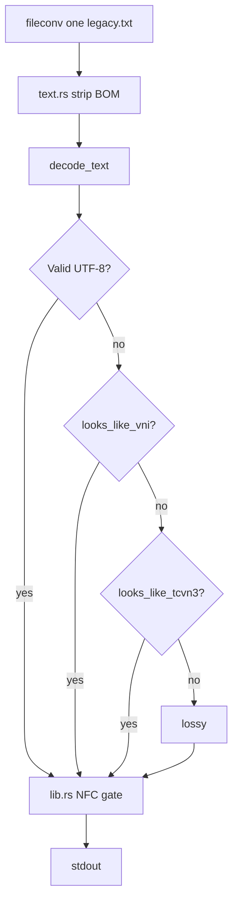

# Issue #367 — Legacy encoding trace (intern-29)

> Read-only trace on local fixtures in `/tmp/issue-367-fixtures/` (bytes from unit tests).
> Date: 2026-08-12.

## Files traced

| Module | Role |
|--------|------|
| [`crates/core/src/viet_legacy.rs`](../crates/core/src/viet_legacy.rs) | TCVN3/VNI/VPS maps + `decode_text` heuristics |
| [`crates/core/src/conv/text.rs`](../crates/core/src/conv/text.rs) | `.txt` → strip BOM → `decode_text` |
| [`crates/core/src/conv/csv_conv.rs`](../crates/core/src/conv/csv_conv.rs) | `.csv` → same decode before parse |
| [`crates/core/src/conv/html.rs`](../crates/core/src/conv/html.rs) | **Metadata path** (documented, not fixture-tested): `<meta charset>` label picks TCVN3/VNI/VPS directly — no byte sniffing |
| [`crates/core/src/lib.rs`](../crates/core/src/lib.rs) | NFC gate on final output (~L244) |

## Pipeline



## Fixtures & commands

```bash
mkdir -p /tmp/issue-367-fixtures
# Write TCVN3/VNI bytes (see unit test constants in viet_legacy.rs)

./target/release/fileconv one /tmp/issue-367-fixtures/tcvn3-cong-hoa.txt
./target/release/fileconv one /tmp/issue-367-fixtures/vni-cong-hoa.txt
./target/release/fileconv one tests/fixtures/sample/contacts.vi.csv
```

## Findings

### Why `html.rs` is listed (not fixture-tested)

Fixtures for this issue are `.txt`/`.csv` only. [`html.rs`](crates/core/src/conv/html.rs) is included because issue #367 asks how encoding is **detected** vs **hinted** — and HTML shows the **metadata path**:

| Format | How legacy encoding is chosen |
|--------|-------------------------------|
| **TXT / CSV** | Byte content only → `decode_text` heuristics (`looks_like_tcvn3`, etc.) |
| **HTML** | Declared charset in `<meta>` / `<?xml?>` **first** → `decode_tcvn3` / `decode_vni` / `decode_vps` by label; byte sniffing only as fallback when no charset is declared |

So HTML answers: *where does the backend trust external metadata instead of guessing from bytes?* That matches the issue constraint (“không guess charset từ TXT content — chỉ từ metadata/hint”). HTML pages that declare `charset=TCVN3` (or VNI/VPS aliases) skip heuristics entirely.

**Not the same as font hint:** `.Vn*H` uppercase-font detection (`tcvn3_case_hint_from_font_name`) is a third, caller-supplied path for docx-style font metadata — neither byte sniffing nor HTML charset labels.

### Charset detection (TXT/CSV — fixture-tested)

- **UTF-8 wins first** — legacy detectors never run on valid UTF-8
- **TCVN3:** `looks_like_tcvn3` — ≥3 high bytes, ≥70% in TCVN3 map
- **VNI:** digraph scoring — ≥3 hits, ≥2 two-byte sequences
- **VPS:** control-byte scoring with TCVN3 tie-break

### Font hint vs auto-detect

- Plain **TXT/CSV:** `decode_text` only — **no** `.Vn*H` uppercase font inference from bytes
- **HTML:** charset from `<meta>` metadata → direct legacy decode (see above); no byte sniffing when label is present
- **UppercaseFont** requires explicit font-name metadata via `decode_tcvn3_with_hint` (e.g. `.VnTimeH` from a docx run)

### NFC normalization

- Applied once at converter output boundary (`lib.rs`), not in `viet_legacy`
- Verified: `is_normalized('NFC', output)` + hexdump shows precomposed UTF-8 (e.g. `e1 bb 99` for `ộ`)

## Results

| Fixture | Detected | Output |
|---------|----------|--------|
| tcvn3-cong-hoa.txt | TCVN3 | Cộng hòa xã hội chủ nghĩa Việt Nam |
| tcvn3-truong-hoc.txt | TCVN3 | Trường học (AsMapped, not uppercased) |
| vni-cong-hoa.txt | VNI | Cộng hòa xã hội chủ nghĩa Việt Nam |
| contacts.vi.csv | UTF-8 (skip legacy) | Markdown table |

Closes https://github.com/anhnth24/project-example/issues/367
