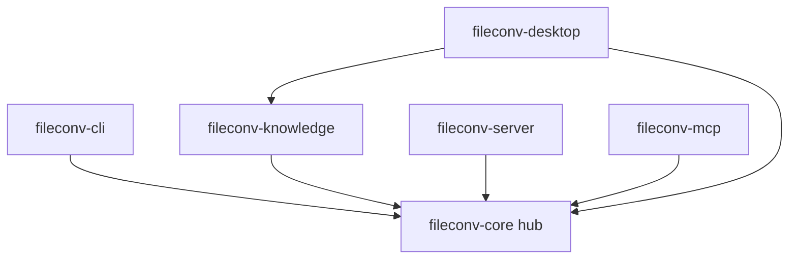

# Issue #368 — Crate dependency audit (intern-30)

> Read-only audit on 2026-08-13. No `Cargo.toml` / `Cargo.lock` changes.

## Workspace

6 members ([`Cargo.toml`](../Cargo.toml)): `fileconv-core`, `fileconv-cli`, `fileconv-knowledge`, `fileconv-server`, `fileconv-mcp`, `fileconv-desktop` (Tauri).

## Tools run

| Tool | Result |
|------|--------|
| `cargo tree --locked` | OK — 856 packages in lockfile |
| `cargo audit` | OK (exit 0); 21 allowed warnings (GTK3 unmaintained, bincode, …) |
| `cargo deny check` | **No `deny.toml`** — default config: advisories/licenses FAILED, bans/sources OK |
| [`scripts/check-dependency-policy.py`](../scripts/check-dependency-policy.py) | passed — git-source ban, license metadata, SHA-pinned Actions |

**Policy script ≠ full audit:** `check-dependency-policy.py` enforces supply-chain *policy*; `cargo audit` scans CVEs; `cargo deny` needs project config for license/advisory rules.

## Metrics

- **Dependency count:** 856 `[[package]]` entries in `Cargo.lock`
- **Tree size (lines, proxy for graph weight):**

| Crate | Lines |
|-------|------:|
| fileconv-core (text-only) | 477 |
| fileconv-core + audio,llm | 743 |
| fileconv-cli (default) | 748 |
| fileconv-server | 1161 |
| fileconv-desktop | 1745 |

- **Longest transitive depth:** ~11 levels (`fileconv-desktop` → Tauri proc-macro chain)
- **Heavy deps:** `whisper-rs-sys`, `pdfium-render`, `tauri` + GTK (Linux desktop)

## Version mismatches (`cargo tree -d`)

Duplicate semver in `fileconv-cli` graph (examples):

- `bitflags` **1.3.2** (via pinned `symphonia 0.5`) vs **2.13.0**
- `zip` ×3, `nom` ×3, `getrandom` ×3
- `syn`, `thiserror`, `regex`, `sha2`, `digest` ×2 each

Intentional pins ([`crates/core/Cargo.toml`](../crates/core/Cargo.toml)): `pdf-extract =0.8.2`, `symphonia 0.5` — do not bump as part of this audit.

## Five audit questions

| Question | Finding |
|----------|---------|
| Circular deps? | None at workspace crate level |
| Unused crates? | `cargo tree` cannot answer; needs `cargo udeps` |
| Version mismatch? | Yes — see duplicates above |
| Security advisory? | No blocking Critical; 21 RustSec warnings (allowed) |
| Recommendation? | **Add `deny.toml`** in a future PR so `cargo deny` matches project license/advisory policy (today default config false-fails licenses) |

## Boundary check

`fileconv-knowledge` with desktop features: **no `tauri` or `axum`** in dependency tree (architecture OK).

## Optimization opportunity (documented only)

**Follow-up: commit a project `deny.toml`** — repo CI already runs `rustsec/audit-check`; adding deny config would unify license allowlists and duplicate-version bans with local `cargo deny check`, instead of relying on cargo-deny’s strict defaults without config.

Alternative noted: CLI/worker builds with `--no-default-features` avoid compiling `whisper-rs` (see [`crates/cli/Cargo.toml`](../crates/cli/Cargo.toml) comments) — already used for lean POC images.

Closes https://github.com/anhnth24/project-example/issues/368
